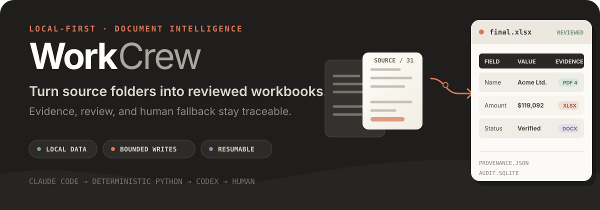
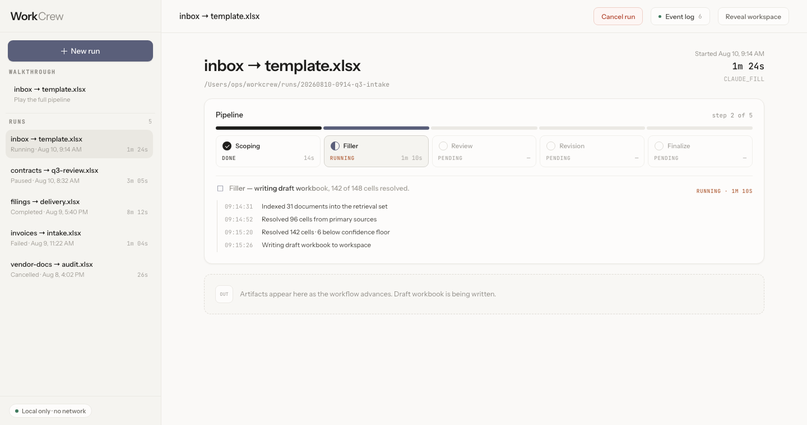
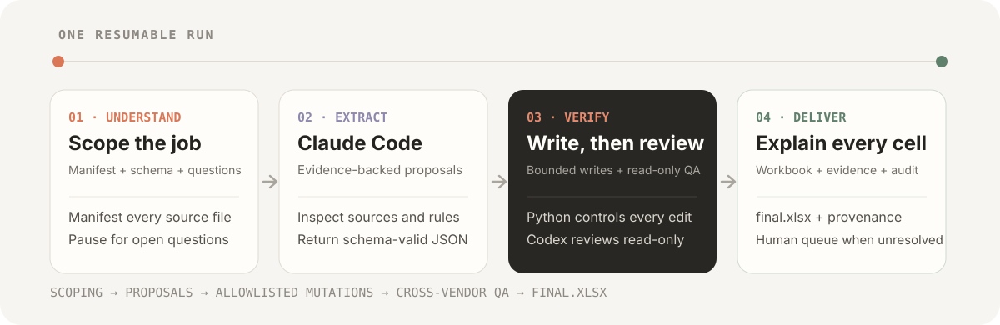

<p align="right">
  <strong>English</strong> · <a href="./README.zh-CN.md">简体中文</a>
</p>

<p align="center">
  
</p>

<p align="center">
  <a href="https://patricktangwen.github.io/WorkCrew/"><strong>Open the interactive walkthrough →</strong></a>
  &nbsp;·&nbsp;
  <a href="#quick-start">Quick start</a>
  &nbsp;·&nbsp;
  <a href="#how-it-works">How it works</a>
  &nbsp;·&nbsp;
  <a href="./project_plan_v3.md">Architecture plan</a>
</p>

WorkCrew is a local-first document-to-workbook workflow for work that needs
more than extraction alone. Give it a source folder, an existing Excel
template, and a plain-language task. It scopes the job, asks Claude Code for
evidence-backed cell proposals, writes only through a deterministic Python
boundary, sends the draft to Codex for independent review, and turns anything
still ambiguous into an explicit human queue.

The result is not just `final.xlsx`. Each run keeps the evidence, review
decisions, revision history, checkpoints, and audit state needed to explain how
the workbook was produced.

## Why WorkCrew

| Semantic work belongs to agents | State-changing work belongs to code |
| --- | --- |
| Claude Code inspects heterogeneous sources, resolves ambiguity, and proposes structured values with evidence. | Pydantic contracts, deterministic rules, an allowlist, and `openpyxl` decide which cells may actually change. |
| Codex independently reopens the evidence and reviews the draft in a read-only sandbox. | LangGraph and SQLite own transitions, pause/resume, retries, cancellation, audit, and termination. |

This separation makes the system useful for document-heavy operations where a
plausible answer is not enough: every accepted value needs a route back to its
source, and unresolved judgment calls should reach a person instead of being
silently filled.

## See the workflow

<p align="center">
  <a href="https://patricktangwen.github.io/WorkCrew/">
    
  </a>
</p>

The public demo is a backend-independent walkthrough of the local workflow
desk. It demonstrates run history, stage progress, lifecycle controls, and
artifact delivery without calling a WorkCrew backend or modifying files.

## How it works

<p align="center">
  
</p>

1. **Understand the job.** WorkCrew copies the inputs into an isolated run
   workspace, inventories every source file, derives the workbook schema, and
   pauses with typed scoping questions when operator input is required.
2. **Extract structured proposals.** Claude Code CLI runs non-interactively
   against the copied workspace and returns schema-valid cell proposals with
   evidence. Agents propose changes; they do not publish `final.xlsx`.
3. **Write, review, and revise.** Python validates every proposal and writes
   allowlisted cells. Codex CLI reviews the draft with an OS-enforced read-only
   sandbox. Actionable findings can enter one bounded Claude revision and one
   targeted Codex re-review for rebutted cells.
4. **Deliver or escalate.** Remaining ambiguity becomes `human_review.md`.
   Completed deliverables are exported beside the source documents while the
   full run workspace retains machine-readable contracts, event history,
   checkpoints, and audit state.

### The trust boundaries

| Boundary | What enforces it |
| --- | --- |
| Original inputs | Sources and the workbook are copied into `runs/<run_id>/`; originals are never edited. |
| Agent handoffs | Claude Code and Codex must return JSON Schema / Pydantic contracts. |
| Workbook writes | Deterministic validation and a cell allowlist gate every `openpyxl` mutation. |
| Independent QA | Codex receives read-only access and cannot modify the workbook it reviews. |
| Recovery | SQLite checkpoints, an audit database, event replay, bounded retries, cancellation, and resume share one run lifecycle. |
| Human judgment | Unresolved conflicts are rendered as a focused review artifact instead of being hidden by a fallback guess. |

> **Local-first, not necessarily offline.** Source copies, workspaces, audit
> state, and outputs stay on the local machine. Claude Code and Codex may still
> use network capabilities allowed by their CLI/runtime configuration; local
> and external-web evidence are labeled separately in provenance.

## What a run produces

Public deliverables are copied to
`<source>/workcrew-output/<run_id>/`. The full isolated workspace remains under
`runs/<run_id>/`.

```text
workcrew-output/<run_id>/
├── final.xlsx                    reviewed workbook
├── provenance.json              cell-level evidence ledger
├── review_explorer_v2.html      offline English review explorer
├── review_explorer_zh_v2.html   offline Chinese review explorer
├── review.md                    independent QA findings
├── revision_log.md              accepted fixes and rebuttals
├── human_review.md              only when judgment is still required
└── run_summary.md               terminal status and stage timings
```

The run workspace also retains the input copies, structured agent outputs,
validation results, WebSocket event history, LangGraph checkpoints, and the
SQLite audit database.

## Quick start

### Prerequisites

- Python 3.12+ and [`uv`](https://docs.astral.sh/uv/)
- Claude Code CLI, signed in for the fill and revision roles
- Codex CLI, signed in for the review and re-review roles
- Node.js and `pnpm` only when building the local web UI

Clone and install the Python environment:

```bash
git clone https://github.com/PatrickTangwen/WorkCrew.git
cd WorkCrew
uv sync --frozen
```

### Run the local web UI

```bash
cd frontend
pnpm install --frozen-lockfile
pnpm build
cd ..
uv run --frozen workflow ui
```

The server binds to `127.0.0.1`, starts at port `8470`, advances to the next
available port when needed, and opens the local workflow desk in a browser.

### Run from the CLI

```bash
uv run --frozen workflow run \
  --source ./source_documents \
  --workbook ./template.xlsx \
  --task "Fill one row per source folder using only supported evidence." \
  --rules-file ./rules.md
```

If the scoping pass pauses, answer the generated questions and resume the same
checkpointed run:

```bash
uv run --frozen workflow resume --run-id <run_id>
```

Use `workflow run --help` for task images, pre-supplied scoping answers, review
policies, per-role model/effort overrides, fake runtimes, and alternate run
roots.

## Evaluation and development

The repository includes a deterministic
[Kleister-Charity adaptation](./benchmark/kleister/README.md) and
[recorded evaluation artifacts](./benchmark/baselines/README.md). Baselines
store metric numerators and denominators, per-cell outcomes, and stage timings
so configuration changes can be compared without reducing quality to one
headline number.

Run the targeted project checks:

```bash
uv run --frozen pytest
uv run --frozen ruff check .
uv run --frozen ruff format --check .

cd frontend
pnpm test
pnpm typecheck
pnpm lint
pnpm build
```

Live agent smoke tests spend subscription quota and are excluded from the
default `pytest` run.

## Project map

| Path | Purpose |
| --- | --- |
| [`src/workflow_app/workflow/`](./src/workflow_app/workflow/) | LangGraph state, routing, execution, and recovery |
| [`src/workflow_app/runtimes/`](./src/workflow_app/runtimes/) | Claude Code, Codex, and deterministic fake runtime adapters |
| [`src/workflow_app/workbook/`](./src/workflow_app/workbook/) | Workbook outline, safety, mutation, and write boundary |
| [`src/workflow_app/provenance/`](./src/workflow_app/provenance/) | Cell-level provenance and bilingual offline explorers |
| [`frontend/`](./frontend/) | React local workflow desk |
| [`docs/adr/`](./docs/adr/) | Frozen architectural decisions and their rationale |
| [`project_plan_v3.md`](./project_plan_v3.md) | Authoritative workflow and architecture plan |

## Scope, stated precisely

- WorkCrew wraps **Claude Code CLI and Codex CLI as non-interactive agent
  runtimes**. It does not use Claude or Codex Agent SDK packages.
- The outer workflow is a deliberate, fixed LangGraph state machine. Native CLI
  subagents may be used internally by a runtime, but they are not required or
  promised by WorkCrew.
- WorkCrew is a local application, not a hosted document-processing service.
  The linked GitHub Pages experience is a static product walkthrough.
