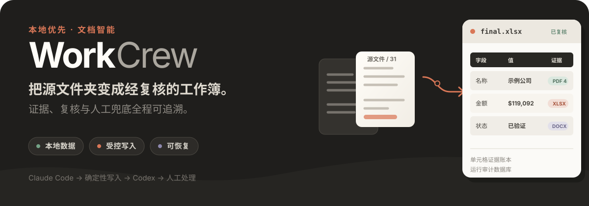
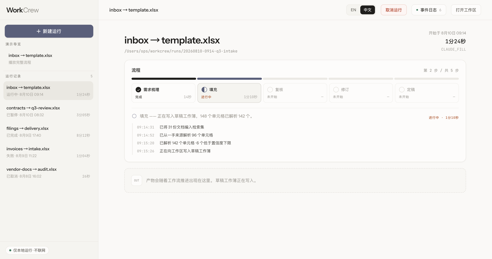
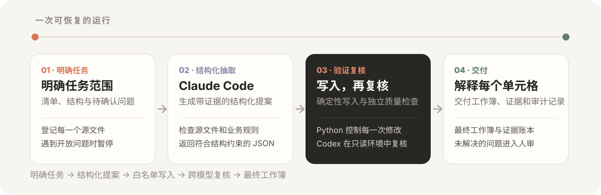

<p align="right">
  <a href="./README.md">English</a> · <strong>简体中文</strong>
</p>

<p align="center">
  
</p>

<h3 align="center">
  ▶&nbsp;&nbsp;打开交互式演示：&nbsp;
  <a href="https://patricktangwen.github.io/WorkCrew/?lang=zh">简体中文</a>
  &nbsp;·&nbsp;
  <a href="https://patricktangwen.github.io/WorkCrew/?lang=en">English</a>
</h3>

<p align="center">
  <a href="#快速开始">快速开始</a>
  &nbsp;·&nbsp;
  <a href="#工作流程">工作流程</a>
  &nbsp;·&nbsp;
  <a href="./project_plan_v3.md">架构方案</a>
</p>

WorkCrew 是一个 local-first 的文档到工作簿工作流，面向那些不能只靠
“抽取出一个看起来合理的答案”完成的任务。给它一个源文件夹、一份现有
Excel 模板和一段自然语言任务描述，它会先明确任务范围，让 Claude Code
提出带证据的单元格值，通过确定性的 Python 边界执行写入，再交给 Codex
做独立复核，最后把仍有歧义的部分整理成清晰的人审队列。

最终结果不只有 `final.xlsx`。每次运行还会保留证据、复核结论、修订历史、
检查点和审计状态，让使用者可以解释这份工作簿是怎样生成的。

## 为什么做 WorkCrew

| 语义工作交给 Agent | 状态变更交给确定性代码 |
| --- | --- |
| Claude Code 检查异构源文件、处理歧义，并提出带证据的结构化值。 | Pydantic 合约、确定性规则、单元格白名单和 `openpyxl` 共同决定哪些位置真的可以修改。 |
| Codex 重新打开证据，在只读沙箱中独立复核草稿。 | LangGraph 和 SQLite 管理状态流转、暂停/恢复、重试、取消、审计与终止条件。 |

这种分工适合对正确性和可追溯性要求较高的文档型业务：每个被接受的值都应
能够回到具体来源；无法确定的判断应该交给人，而不是被一个兜底猜测悄悄填上。

## 看看实际流程

<p align="center">
  <a href="https://patricktangwen.github.io/WorkCrew/?lang=zh">
    
  </a>
</p>

公开演示是一个不依赖后端的本地工作台 walkthrough，展示运行历史、阶段进度、
生命周期控制和产物交付；它不会调用 WorkCrew 后端，也不会修改任何文件。

演示页提供英文和简体中文两个版本，由 `lang` 参数决定语言，因此每个链接都会按
它标注的语言打开，可以直接复制转发；页头的 `EN / 中文` 开关会把地址栏同步成
当前显示的语言。不带该参数时，页面跟随访问者的浏览器语言。

<h3 align="center">
  <a href="https://patricktangwen.github.io/WorkCrew/?lang=zh">▶&nbsp;&nbsp;简体中文演示</a>
  &nbsp;&nbsp;&nbsp;|&nbsp;&nbsp;&nbsp;
  <a href="https://patricktangwen.github.io/WorkCrew/?lang=en">▶&nbsp;&nbsp;English demo</a>
</h3>

## 工作流程

<p align="center">
  
</p>

1. **明确任务。** WorkCrew 把输入复制到隔离的运行工作区，为每个源文件建立
   清单，推导工作簿 schema；需要操作者判断时，用类型化问题暂停工作流。
2. **生成结构化提案。** Claude Code CLI 在输入副本上以非交互方式运行，返回
   通过 schema 的单元格提案和证据。Agent 只提出变更，不直接发布
   `final.xlsx`。
3. **写入、复核、修订。** Python 逐项验证提案，只写入白名单允许的单元格。
   Codex CLI 在操作系统强制的只读沙箱中独立复核草稿。可执行的发现进入一次
   有边界的 Claude 修订；被反驳的单元格最多再接受一次 Codex 定向复核。
4. **交付或升级人审。** 剩余歧义写入 `human_review.md`。完成后的公开产物会
   导出到源文件旁边；完整运行工作区继续保存机器可读合约、事件历史、检查点
   和审计状态。

### 信任边界

| 边界 | 约束方式 |
| --- | --- |
| 原始输入 | 源文件和工作簿被复制到 `runs/<run_id>/`；原件不被修改。 |
| Agent 交接 | Claude Code 和 Codex 必须返回 JSON Schema / Pydantic 合约。 |
| 工作簿写入 | 确定性验证和单元格白名单控制每一次 `openpyxl` 修改。 |
| 独立 QA | Codex 只有只读权限，无法修改它正在复核的工作簿。 |
| 恢复能力 | SQLite 检查点、审计数据库、事件回放、有边界重试、取消与恢复共用同一个运行生命周期。 |
| 人类判断 | 无法解决的冲突会形成聚焦的人审产物，而不是被兜底猜测掩盖。 |

> **Local-first 不等于必然离线。** 源文件副本、运行工作区、审计状态和输出都
> 留在本机；但 Claude Code 与 Codex 仍可能使用各自 CLI / runtime 配置允许的
> 网络能力。本地证据和外部 Web 证据会在 provenance 中分开标记。

## 一次运行会产生什么

公开交付物会复制到 `<source>/workcrew-output/<run_id>/`；完整的隔离工作区
保留在 `runs/<run_id>/`。

```text
workcrew-output/<run_id>/
├── final.xlsx                    经复核的工作簿
├── provenance.json              单元格级证据账本
├── review_explorer_v2.html      可离线打开的英文复核浏览器
├── review_explorer_zh_v2.html   可离线打开的中文复核浏览器
├── review.md                    独立 QA 发现
├── revision_log.md              已接受的修正与反驳记录
├── human_review.md              仅在仍需人工判断时出现
└── run_summary.md               最终状态与各阶段耗时
```

运行工作区还会保留输入副本、结构化 Agent 输出、验证结果、WebSocket 事件历史、
LangGraph 检查点和 SQLite 审计数据库。

## 快速开始

### 前置条件

- Python 3.12+ 与 [`uv`](https://docs.astral.sh/uv/)
- 已登录的 Claude Code CLI，用于填充和修订角色
- 已登录的 Codex CLI，用于复核和定向再复核角色
- 仅在构建本地 Web UI 时需要 Node.js 与 `pnpm`

克隆仓库并安装 Python 环境：

```bash
git clone https://github.com/PatrickTangwen/WorkCrew.git
cd WorkCrew
uv sync --frozen
```

### 启动本地 Web UI

```bash
cd frontend
pnpm install --frozen-lockfile
pnpm build
cd ..
uv run --frozen workflow ui
```

服务器只绑定 `127.0.0.1`，默认从 `8470` 端口启动；端口占用时会寻找下一个
可用端口，并在浏览器中打开本地工作台。

### 使用 CLI 运行

```bash
uv run --frozen workflow run \
  --source ./source_documents \
  --workbook ./template.xlsx \
  --task "仅使用有证据支持的内容，为每个源文件夹填写一行。" \
  --rules-file ./rules.md
```

如果 scoping 阶段暂停，回答生成的问题后，从同一个检查点恢复：

```bash
uv run --frozen workflow resume --run-id <run_id>
```

运行 `workflow run --help` 可以查看任务图片、预先提供的 scoping answers、
review policy、各角色的模型/推理强度覆盖、fake runtime 和自定义运行目录等选项。

## 评估与开发

仓库包含确定性的 [Kleister-Charity 适配](./benchmark/kleister/README.md)和
[已记录的评估产物](./benchmark/baselines/README.md)。Baseline 会保留指标的
分子/分母、逐单元格结果和阶段耗时，便于比较配置变化，而不是把质量压缩成一个
缺少上下文的总分。

运行项目检查：

```bash
uv run --frozen pytest
uv run --frozen ruff check .
uv run --frozen ruff format --check .

cd frontend
pnpm test
pnpm typecheck
pnpm lint
pnpm build
```

真实 Agent smoke tests 会消耗订阅配额，因此默认 `pytest` 不会运行它们。

## 项目地图

| 路径 | 作用 |
| --- | --- |
| [`src/workflow_app/workflow/`](./src/workflow_app/workflow/) | LangGraph 状态、路由、执行与恢复 |
| [`src/workflow_app/runtimes/`](./src/workflow_app/runtimes/) | Claude Code、Codex 与确定性 fake runtime 适配器 |
| [`src/workflow_app/workbook/`](./src/workflow_app/workbook/) | 工作簿轮廓、安全、变更与写入边界 |
| [`src/workflow_app/provenance/`](./src/workflow_app/provenance/) | 单元格级 provenance 与双语离线浏览器 |
| [`frontend/`](./frontend/) | React 本地工作台 |
| [`docs/adr/`](./docs/adr/) | 已冻结的架构决策及原因 |
| [`project_plan_v3.md`](./project_plan_v3.md) | 权威工作流与架构方案 |

## 准确说明项目边界
- 外层工作流是一张有意保持固定的 LangGraph 状态图。CLI runtime 内部可能自行
  使用原生 subagent，但 WorkCrew 不依赖、也不承诺这种行为一定发生。
- WorkCrew 是本地应用，不是托管式文档处理服务。链接中的 GitHub Pages 页面
  是静态产品演示。
